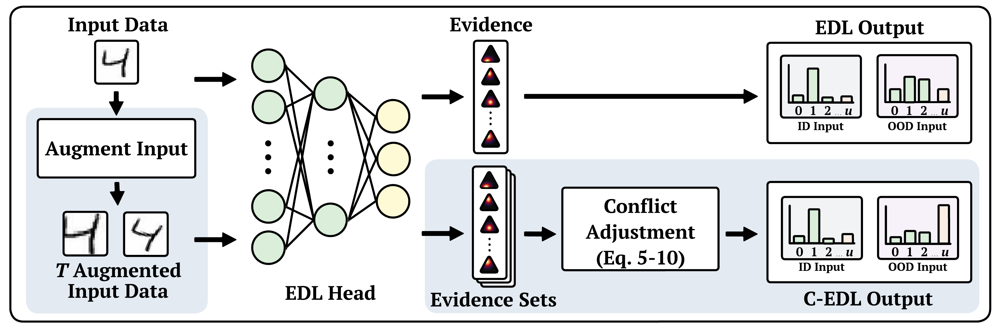

# Conflict-aware Evidential Deep Learning

This repository contains the code to reproduce Conflict-aware Evidential Deep Learning (C-EDL) and more general code to recreate all the experiments found in our paper!

## C-EDL
Our Conflict-aware Evidential Deep Learning (C-EDL) approach, whose high-level workflow is shown in the Figure below, improves robustness to OOD and adversarially attacked inputs. Motivated by the DST principle that multiple sources of evidence yield more reliable beliefs, C-EDL generates diverse views of each input through label-preserving metamorphic transformations, combines the resulting evidence sets, and quantifies their discernment. When conflict is detected across these views, C-EDL reduces the overall evidence to signify greater uncertainty, resulting in better detection of OOD and adversarially attacked inputs without affecting the ID data detection and accuracy.



## Setup
To use the code provided, you must install the following dependencies first:

```python
numpy==1.26.4
eagerpy==0.30.0
foolbox==3.3.4
matplotlib==3.10.1
tensorflow==2.15.0
scipy==1.15.2
tqdm==4.67.1
scikit-learn==1.6.1
opencv-python==4.11.0.86
tensorflow-datasets==4.9.8
datasets==3.1.0
bs4==0.0.2
```

Then, to use C-EDL and the other comparative methods, you must edit the main Python file. See an example below!: 

```python
dataset_manager = DatasetManager()
x_train_id, y_train_id, _, _, _, _ = dataset_manager.get_dataset(Datasets.FLOWERS)
x_train_ood, y_train_ood, _, _, _, _ = dataset_manager.get_dataset(Datasets.DeepWeeds)

model = models.ConflictingEvidentialMetaModel(x_train=x_train_id, y_train=y_train_id, learning_rate=0.001)
model.train(batch_size=64, epochs=250, verbose=0)

evaluator = ClassificationEvaluator(model, Datasets.FLOWERS, Datasets.DeepWeeds, threshold=Thresholds.DIFF_ENTROPY)
results = evaluator.evaluate_data()

results = evaluator.evaluate_attack(Attacks.L2PGD, dataset_type="OOD", epsilons=[0.1])
```

In the code snippet above, you can specify any in-distribution (ID) and out-of-distribution (OOD) dataset, any model, decision threshold, and Foolbox attack and strength from the list of supported items below. If you want specific values to replicate each experiment shown in our paper, please refer to Appendix C for how each experiment was set up!


## Supported Models, Attacks, and Datasets
Below is a list of what datasets, models, decision thresholds, and attacks you can use to replicate the experiments in our paper.

### Datasets

Currently support:
| Image Size       | Colour Mode | Datasets                      |
|------------------|-------------|-------------------------------|
| 28 × 28          | B&W         | MNIST, FashionMNIST, KMNIST, EMNIST |
| 32 × 32          | RGB         | CIFAR10, CIFAR100             |
| 64 × 64          | RGB         | DeepWeeds, OxfordFlowers      |

### Models

Currently support:
## Supported Models
| Model Name                             | Type/Notes                         |
|----------------------------------------|------------------------------------|
| Deep Neural Network                    | Standard baseline                  |
| MC-Dropout Network                      | With Adaptive MC Dropout           |
| Posterior Network                      | Uncertainty-aware                  |
| Evidential Network                     | Base evidential model              |
| Fisher-Information Evidential Network | Uses Fisher Information            |
| Smoothed Evidential Network           | Adds post-hoc smoothing to Dirichlet evidence |
| Hyper-opinion Evidential Network      | Hyper-prior over evidence          |
| Relaxed Evidential Network            | Relaxed Dirichlet assumptions      |
| Density Aware Evidential Network      | Incorporates input density         |
| Evidential++ Network                  | Meta & MC variants                 |
| Conflicting Evidential Network        | Meta & MC variants with conflict-aware scaling |


### Threshold Metrics

Currently support:
| Metric Name         | Description                        |
|---------------------|------------------------------------|
| Differential Entropy | Measures spread of predictive distribution |
| Total Alpha         | Sum of Dirichlet concentration parameters |
| Mutual Information  | Captures epistemic uncertainty     |

### Attacks

Currently support:
| Attack Name   | Type                   |
|---------------|------------------------|
| L2PGD         | Gradient (iterative, L2-norm) |
| FGSM          | Gradient (single-step, L∞-norm) |
| Salt & Pepper | Non-gradient (impulse noise)        |
